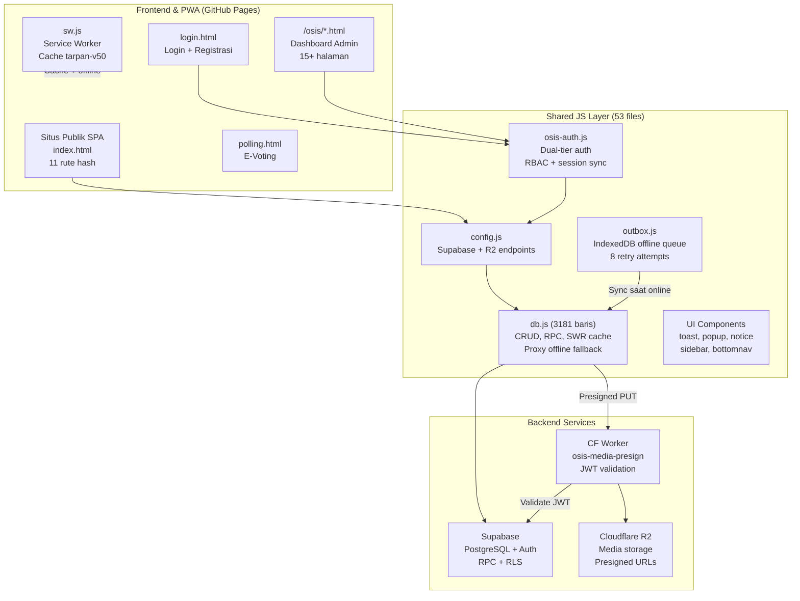
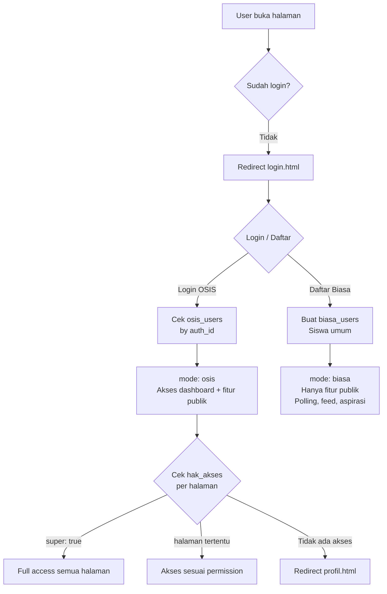
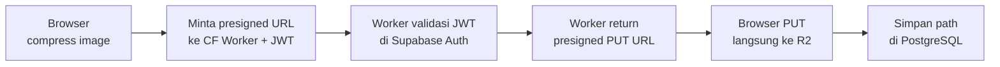
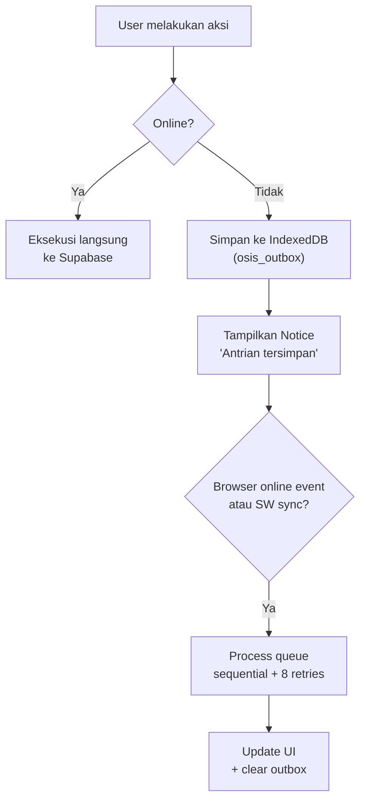

# 🏫 Analisis Lengkap: OSIS TARPAN ONE

> Sistem manajemen organisasi OSIS SMK Taruna Harapan 1 Cipatat — full-stack vanilla JS + Supabase + Cloudflare R2

**Domain:** `osistarpanone.my.id`
**Versi terakhir:** v6.3.0 (2026-09-27) — 42 rilis sejak v1.0.0

---

## Ringkasan Umum

**OSIS TARPAN ONE** adalah aplikasi web komprehensif untuk mengelola seluruh kegiatan organisasi OSIS sekolah. Dibangun **tanpa framework** (vanilla HTML/CSS/JS) dengan **53 file JavaScript**, menggunakan **Supabase** sebagai backend, **Cloudflare R2** untuk media, dan di-host di **GitHub Pages**.

> [!IMPORTANT]
> Proyek ini memiliki **dua sisi** dengan arsitektur berbeda:
> - **Situs Publik** → SPA (hash router) di `index.html` — 11 view/rute
> - **Dashboard OSIS** → MPA di `/osis/` — 15+ halaman, dilindungi auth

---

## Arsitektur Sistem



---

## Tech Stack

| Layer | Teknologi |
|---|---|
| **Frontend** | Vanilla HTML/CSS/JS (53 file JS, tanpa framework) |
| **Design** | Neo-Brutalism — border tebal, hard shadow, warna bold |
| **Font** | Google Fonts — Outfit (400–900) |
| **Icons** | Font Awesome 6.5 |
| **Backend DB** | Supabase PostgreSQL + RPC stored procedures |
| **Auth** | Supabase Auth (synthetic email mapping) |
| **Media** | Cloudflare R2 via Worker presigned URLs (SigV4) |
| **Hosting** | GitHub Pages (`osistarpanone.my.id`) |
| **PWA** | Service Worker + Web Manifest + IndexedDB outbox |
| **Offline** | Stale-While-Revalidate cache + IndexedDB mutation queue |

---

## Struktur File

```
osistarpanone/
├── index.html              # Situs publik SPA (2542 baris)
├── login.html              # Login + registrasi (slider 2 tahap)
├── polling.html            # E-voting kandidat OSIS
├── jepun.html              # Quiz huruf Jepang (standalone)
├── changelog.html          # Riwayat versi (DB-driven)
├── offline.html            # Fallback offline PWA
├── sw.js                   # Service Worker (tarpan-v50)
├── manifest.webmanifest    # PWA manifest + app shortcuts
├── CNAME                   # osistarpanone.my.id
│
├── css/
│   └── style.css           # Design system (2300+ baris)
│
├── js/                     # 53 file JavaScript
│   ├── config.js           # Supabase + R2 environment config
│   ├── db.js               # Database layer (3181 baris, SWR cache)
│   ├── app.js              # SPA router + FotoWeb + currency utils
│   ├── osis-auth.js        # Dual-tier auth + RBAC
│   ├── outbox.js           # IndexedDB offline mutation queue
│   ├── login.js            # Login/register engine
│   ├── dashboard.js        # Dashboard metrics + parallel fetch
│   ├── osis-sidebar.js     # Dynamic drawer nav (DB-backed)
│   ├── osis-header.js      # Responsive header + overflow
│   ├── osis-menu.js        # Desktop nav pills
│   ├── bottomnav.js        # Bottom nav bar + sheet drawer
│   ├── nav-atur.js         # Visual nav editor (admin)
│   ├── show-popup.js       # Modal system + LIFO history stack
│   ├── toast.js            # Toast notifications
│   ├── notice.js           # Persistent status pills
│   ├── form-persist.js     # Auto-save form drafts
│   ├── aktivitas.js        # Activity logger + presence heartbeat
│   ├── pwa.js              # SW lifecycle + install prompt
│   ├── site-edit.js        # Inline content/photo editor (936 baris)
│   ├── visitor.js          # Device fingerprint + analytics
│   │
│   │ # --- Modul Halaman OSIS ---
│   ├── anggota.js          # Member roster + sekbid assignment
│   ├── absensi.js          # Attendance (1270 baris)
│   ├── tabungan.js         # Savings tracking
│   ├── keuangan.js         # Financial ledger + receipt upload
│   ├── agenda.js           # Calendar events + timeline
│   ├── dokumen.js          # Document repository
│   ├── poster.js           # Poster gallery + lightbox
│   ├── informasi.js        # Internal broadcast
│   ├── program.js          # Annual/monthly work programs
│   ├── proker.js           # Divisional program tracker
│   ├── akses.js            # Super Admin permission matrix
│   ├── profil.js           # Self-profile management
│   ├── logs.js             # Real-time activity monitoring
│   ├── evaluasi.js         # Activity evaluation + ratings
│   ├── notulensi.js        # Meeting minutes
│   ├── task.js             # Kanban task board
│   ├── formulir.js         # Drag-and-drop form builder
│   ├── form-publik.js      # Public form response engine
│   │
│   │ # --- Modul Halaman Publik ---
│   ├── home.js             # Homepage controller + bento slider
│   ├── pengurus.js         # Leadership directory
│   ├── sekbid.js           # Division cards renderer
│   ├── galeri.js           # Bento-grid gallery
│   ├── arsip.js            # Photo documentation archive
│   ├── moments.js          # Reels/explore media feed
│   ├── feed.js             # Social feed (likes/comments)
│   ├── aspirasi.js         # Student aspiration submissions
│   ├── lagu.js             # Radio song request system
│   ├── informasi-view.js   # Public announcement viewer
│   ├── prestasi.js         # Achievement showcase
│   ├── changelog.js        # Version release notes
│   ├── polling.js          # Voting system
│   └── kegiatan.js         # Bento activity cards
│
├── osis/                   # Dashboard OSIS (MPA, auth-gated)
│   ├── index.html          # Dashboard utama
│   ├── anggota.html        # Manajemen anggota
│   ├── absensi.html        # Absensi kehadiran
│   ├── tabungan.html       # Tabungan pengurus
│   ├── keuangan.html       # Keuangan/kas
│   ├── agenda.html         # Agenda kegiatan
│   ├── dokumen.html        # Arsip dokumen
│   ├── poster.html         # Galeri poster
│   ├── informasi.html      # Broadcast internal
│   ├── program-tahunan.html
│   ├── program-bulanan.html
│   ├── akses.html          # Manajemen hak akses
│   ├── profil.html         # Profil user
│   ├── logs.html           # Log aktivitas
│   └── _template.html      # Template halaman baru
│
├── worker/                 # Cloudflare Worker
│   ├── osis-media-presign.js  # R2 presign + SigV4 (zero-dependency)
│   └── wrangler.toml
│
└── tools/                  # Script admin (Node.js)
    ├── migrasi-auth-bulk.mjs
    ├── reset-password.mjs
    └── migrate-supabase-to-r2.mjs
```

---

## Sistem Autentikasi & Otorisasi

### Dual-Tier Account Architecture



| Aspek | Detail |
|---|---|
| **Akun OSIS** | Pengurus OSIS → tabel `osis_users` → email sintetis `osis-<id>@osistarpanone.my.id` |
| **Akun Biasa** | Siswa umum → tabel `biasa_users` → email sintetis `biasa-<id>@osistarpanone.my.id` |
| **Session** | Supabase Auth JWT + localStorage cache (`osis_user`, `osis_akses`) |
| **Sync** | `OsisAuth.syncAuth()` — SWR: render dari cache, verify di background |
| **RBAC** | `OsisAuth.bisa(halaman)` — cek `super`, `"*"`, atau halaman spesifik |
| **Guard** | `OsisAuth.butuh(halaman)` — block + toast error jika tidak punya akses |

### Hak Akses (tersimpan di tabel `osis_akses`)
```javascript
{
  halaman: ["anggota", "keuangan", "agenda", ...],
  sekbid_id: 3,
  sekbid_nama: "Sekbid 3 (Bela Negara)",
  super: false
}
```

---

## Database Layer (`db.js` — 3181 baris)

### Fitur Utama

| Fitur | Implementasi |
|---|---|
| **CRUD** | Supabase RPC wrappers untuk semua tabel |
| **SWR Cache** | `Cache` singleton → `osis_cache_v2_<key>` di localStorage |
| **Offline Proxy** | `supa` dibungkus Proxy → throw friendly error saat offline |
| **Image Compression** | `compressImage()` — resize canvas ≤1920px, iterasi JPEG quality 0.85→0.40 hingga <0.95MB |
| **Presigned Upload** | `r2MintaPresign("put", path)` → Worker → PUT langsung ke R2 |
| **Device Fingerprint** | `getDeviceId()` — dual-store di localStorage + cookie (2 tahun) |
| **Server Auth** | Setiap RPC kirim `p_user_id: _uid()` → PostgreSQL verify permission |

### Alur Upload Media


---

## Semua Modul & Fitur (53 JS Files)

### 🔐 Dashboard OSIS (Internal)

| Modul | File | Baris | Deskripsi |
|---|---|---:|---|
| **Dashboard** | `dashboard.js` | 335 | Command center, parallel data fetch, metrics |
| **Anggota** | `anggota.js` | 910 | CRUD pengurus, biodata, sekbid, foto drag-drop |
| **Absensi** | `absensi.js` | 1,270 | Sesi absensi, roll call, mode "absen langsung", statistik |
| **Tabungan** | `tabungan.js` | 827 | Setoran/penarikan, saldo per anggota |
| **Keuangan** | `keuangan.js` | 997 | Kas OSIS, grafik bulanan, nota foto, PDF export |
| **Agenda** | `agenda.js` | 749 | Kalender, timeline, filter sekbid |
| **Dokumen** | `dokumen.js` | 604 | Repository file (PDF/Word/Excel/PPT/ZIP) |
| **Poster** | `poster.js` | 269 | Galeri poster + lightbox |
| **Informasi** | `informasi.js` | 350 | Broadcast internal pengurus |
| **Program** | `program.js` | 487 | Program tahunan & bulanan |
| **Proker** | `proker.js` | 697 | Tracker program per divisi, fase, progress |
| **Evaluasi** | `evaluasi.js` | 743 | Rating 1-5 bintang, follow-up, PDF export |
| **Notulensi** | `notulensi.js` | 600 | Notulen rapat, peserta, print view |
| **Task** | `task.js` | 522 | Kanban board (todo → in_progress → review → done) |
| **Formulir** | `formulir.js` | 1,097 | Form builder drag-and-drop, response viewer, export |
| **Akses** | `akses.js` | 288 | Permission matrix, toggle akses per halaman |
| **Profil** | `profil.js` | 336 | Self-profile, foto, bio, ganti password |
| **Logs** | `logs.js` | 238 | Real-time monitoring aktivitas + presence |

### 🌐 Situs Publik

| Modul | File | Baris | Deskripsi |
|---|---|---:|---|
| **Home** | `home.js` | 681 | Homepage, sejarah angkatan, bento slider, ticker |
| **Pengurus** | `pengurus.js` | 811 | Direktori kepemimpinan (ketua, wakil, kabinet) |
| **Sekbid** | `sekbid.js` | 119 | Kartu divisi BPH & Sekbid 1-10 |
| **Galeri** | `galeri.js` | 546 | Bento-grid galeri kegiatan + inline editing |
| **Arsip** | `arsip.js` | 690 | Arsip foto dokumentasi + pagination server-side |
| **Moments** | `moments.js` | 827 | Feed bergaya Instagram Explore / TikTok Reels, auto-play video |
| **Feed** | `feed.js` | 945 | Social feed — foto/video, like, komentar, share, filter kategori |
| **Aspirasi** | `aspirasi.js` | 533 | Form aspirasi siswa (anonim/private), feed masuk |
| **Lagu** | `lagu.js` | 542 | Request lagu radio jam istirahat, antrian playlist |
| **Info Publik** | `informasi-view.js` | 837 | Pengumuman publik, detail modal, share |
| **Prestasi** | `prestasi.js` | 412 | Showcase prestasi siswa, tier kompetisi |
| **Polling** | `polling.js` | 530 | E-voting, 1-akun-1-suara, live result, admin control |
| **Kegiatan** | `kegiatan.js` | 709 | Bento cards kegiatan dari database |
| **Form Publik** | `form-publik.js` | 308 | Engine response form publik |

### ⚙️ Infrastruktur & UI

| Modul | File | Baris | Deskripsi |
|---|---|---:|---|
| **Config** | `config.js` | 20 | Environment variables |
| **DB Layer** | `db.js` | 3,181 | CRUD, RPC, cache, compression, presign |
| **Auth** | `osis-auth.js` | 268 | Session sync, RBAC, dual-tier |
| **Login** | `login.js` | 452 | Login/register engine |
| **SPA Router** | `app.js` | 321 | Hash router, FotoWeb, currency utils |
| **Sidebar** | `osis-sidebar.js` | 719 | Drawer nav + live editor (DB-backed) |
| **Header** | `osis-header.js` | 162 | Responsive header + overflow menu |
| **Menu** | `osis-menu.js` | 54 | Desktop nav pills |
| **Bottom Nav** | `bottomnav.js` | 309 | Fixed bottom nav + center sheet |
| **Nav Editor** | `nav-atur.js` | 512 | Visual nav item editor |
| **Popup** | `show-popup.js` | 621 | Modal dialogs + LIFO back-button stack |
| **Toast** | `toast.js` | 50 | Toast notifications |
| **Notice** | `notice.js` | 193 | Persistent status pills |
| **Form Persist** | `form-persist.js` | 142 | Auto-save drafts ke localStorage |
| **Aktivitas** | `aktivitas.js` | 139 | Logger + presence heartbeat (60s) |
| **Outbox** | `outbox.js` | 1,308 | IndexedDB offline queue + auto-sync |
| **PWA** | `pwa.js` | 286 | SW lifecycle + install prompt |
| **Site Edit** | `site-edit.js` | 936 | Inline content/photo editor |
| **Visitor** | `visitor.js` | 468 | Device fingerprint + analytics |
| **Changelog** | `changelog.js` | 310 | DB-driven release notes + editor |
| **Supabase** | `supabase.min.js` | 17 | Vendored Supabase client |

**Total: ~22,000+ baris kode JavaScript** (tidak termasuk supabase.min.js)

---

## Database (Supabase PostgreSQL)

| Tabel | Fungsi |
|---|---|
| `osis_users` | Data pengurus OSIS (+ `auth_id` link ke Supabase Auth) |
| `biasa_users` | Akun siswa umum |
| `osis_akses` | Hak akses per user per halaman |
| `sesi_absensi` | Sesi absensi (rapat, kegiatan) |
| `absensi` | Record kehadiran per anggota per sesi |
| `tabungan` | Transaksi tabungan |
| `keuangan` | Transaksi kas OSIS |
| `agenda` | Agenda kegiatan |
| `dokumen` | Arsip dokumen |
| `poster` | Data poster |
| `program` | Program kerja (tahunan/bulanan) |
| `informasi` | Informasi internal |
| `informasi_publik` | Pengumuman publik |
| `galeri_publik` | Foto galeri publik |
| `informasi_sekolah` | Data sekolah (visi/misi) |
| `polling` / `polling_votes` | Polling + suara |
| `aktivitas` | Log aktivitas / audit trail |
| `web_foto` | Foto dinamis website |
| `site_content` | Konfigurasi UI (sidebar menu, bottomnav, dll) |
| `formulir` / `formulir_respons` | Form builder + response |

---

## Cloudflare Worker & R2

### Worker: `osis-media-presign.js`
- **Zero-dependency SigV4** — AWS Signature v4 murni pakai Web Crypto API
- **JWT validation** — Verifikasi Supabase Auth token + cek `osis_users`
- **Folder allowlist** — `gallery`, `web`, `profil`, `anggota`, `kas`, `moments`, `feed`, `polling`, `formulir`, dll
- **MIME allowlist** — JPEG, PNG, WebP, GIF, PDF, MP4, WebM, audio

| Endpoint | Method | Fungsi |
|---|---|---|
| `/file/*` | GET | Serve file dari R2 |
| `/upload` | POST | Upload file ke R2 (auth required) |
| `/delete` | DELETE | Hapus file |
| `/copy` | POST | Salin file |
| `/list` | GET | List file by prefix |
| `/rename` | POST | Rename file |
| `/bulk-delete` | POST | Batch delete |

> [!NOTE]
> Upload publik (tanpa login) hanya diizinkan untuk path `formulir/f-<id>-<ts>.<ext>` — response form publik.

---

## Offline-First Architecture



| Komponen | Mekanisme |
|---|---|
| **Service Worker** | Cache `tarpan-v50`, precache 60+ aset, network-first HTML, cache-first statis |
| **Outbox** | IndexedDB `osis_outbox`, auto-sync on `online` event + SW `sync` |
| **SWR Cache** | `osis_cache_v2_<key>` di localStorage, render cached → fetch fresh → update |
| **Supabase Proxy** | `db.js` wrap `supa` dalam Proxy, graceful error saat offline |
| **Offline Fallback** | `offline.html` untuk navigasi, SVG placeholder untuk gambar |

---

## Design System (CSS Neo-Brutalism)

### CSS Variables
```css
:root {
  --red: #e11d2e;        /* Primary merah */
  --red-dark: #b3121f;   /* Hover/active */
  --red-deep: #7f0d16;   /* Kontras gelap */
  --ink: #1a1314;        /* Teks & border */
  --white: #ffffff;
  --paper: #fffdfa;      /* Canvas utama (warm off-white) */
  --paper-2: #f5efea;    /* Surface sekunder */
  --line: #e8e0da;       /* Separator */
  --gray: #6f6668;       /* Teks muted */
  --yellow: #ffd11a;     /* Aksen kuning */
  --green: #1a7f37;      /* Success */
  --shadow-hard: 5px 5px 0 var(--ink);  /* Signature neo-brutalist */
  --radius: 22px;        /* Bento card radius */
}
```

### Karakteristik Visual
| Aspek | Detail |
|---|---|
| **Outline** | Border tebal 2.5–3px solid `var(--ink)` |
| **Shadow** | Hard offset shadow tanpa blur (`5px 5px 0`) |
| **Interaksi** | Hover: translate up-left + shadow expand; Active: translate down-right + shadow zero |
| **Typography** | Outfit font, weight 700–900, uppercase labels |
| **Layout** | Bento grid, `--radius: 22px` |
| **Responsive** | Mobile-first, safe-area insets, adaptive grid 1→4 kolom |

---

## Interaction Architecture

```
┌─────────────────────────────────────────────────────────┐
│                      BROWSER CLIENT                      │
│                                                          │
│  [app.js] ←→ [Router] (11 SPA views)                   │
│     ├→ [FotoWeb] (dynamic web asset replacement)        │
│     └→ [formatRupiah] (currency formatting)             │
│                                                          │
│  [UI Shell]                                              │
│     ├→ [osis-sidebar.js] (DB-backed drawer nav)         │
│     ├→ [osis-header.js] (responsive overflow)           │
│     ├→ [bottomnav.js] (pill nav + center sheet)         │
│     ├→ [show-popup.js] (modals + LIFO history stack)    │
│     ├→ [toast.js] (transient alerts)                    │
│     └→ [notice.js] (persistent status pills)            │
│                                                          │
│  [Auth & State]                                          │
│     ├→ [osis-auth.js] (dual-tier, RBAC, session sync)   │
│     ├→ [aktivitas.js] (heartbeat 60s, route logging)    │
│     ├→ [outbox.js] (IndexedDB offline queue)            │
│     ├→ [form-persist.js] (draft auto-save)              │
│     └→ [visitor.js] (device fingerprint + analytics)    │
│                                                          │
│  [Data Layer]                                            │
│     └→ [db.js] ←→ [Cache] (SWR localStorage)           │
│            ↓                    ↓                        │
│     Supabase RPC          Presigned R2 PUT               │
└─────────────────────────────────────────────────────────┘
```

---

## Tools Admin (Node.js CLI)

| Script | Fungsi |
|---|---|
| `migrasi-auth-bulk.mjs` | Migrasi akun lama → Supabase Auth, generate email sintetis |
| `reset-password.mjs` | Reset password via Admin API |
| `migrate-supabase-to-r2.mjs` | Pindahkan media dari Supabase Storage ke Cloudflare R2 |
